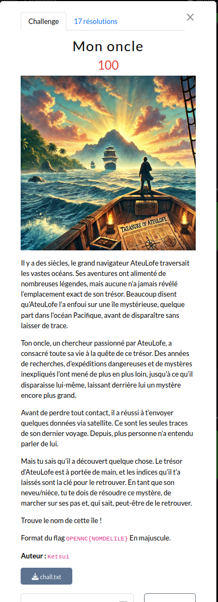

# Mon Oncle

 

Le challenge propose de télécharger un message d'un oncle `chall.txt`

Le contenu ressemble à du base64 : 

```
cat chall.txt | base64 -d 

type    latitude        longitude       name    desc                                                                                           
T       55.4788535      -117.0703125            Length: 83118 km (51647 mi)                                                                    
T       42.9403392      -119.7070313                                   
T       31.3536369      -108.8085938                                                                                                           
T       40.5805847      -98.6132813                                    
T       47.6357836      -108.2812500                                   
T       52.4827802      -91.4062500
```

Bingo! Cela donne une liste de coordonnées. 
Il faut extraire des coordonnées pour former un fichier `gpx` de la forme suivante : 

```
<?xml version="1.0" encoding="UTF-8"?>
<gpx version="1.1" creator="Coordonneesgps.net" xmlns="http://www.topografix.com/GPX/1/1">
<rte>
        <name>GPX</name>
		<rtept lat="55.4788535" lon="-117.0703125"></rtept>
		....
</rte>
</gpx>
```

L'extraction peut se faire via la commande : 
```
cat ../mononcle/chall.gpx | egrep "^T"| awk '{print "\t<rtept lat=\""$2"\" lon=\""$3"\"></rtept>"}' > ../mononcle/chal.gpx
```

L'ouverture du fichier `gpx` via GNOME Maps ou autre affiche un tracé dont une certaine concentration de traits dans le Pacifique.
Certains tracé forment des flèches d'autre semble former des caractères. Ces derniers forment le drapeau. 

 
